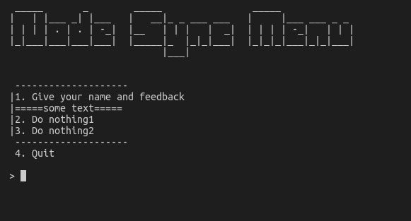

# node-sync-menu
Create simple sync console menu in nodejs



How to use it:

```javascript
const menu = require('../src/node-sync-menu');
const readline = require('readline-sync');

menu.addItem("Give your name and feedback", async () => {
    let name = readline.question("What is your name?[unknown]: ", {
        defaultInput: "unknown"
    });
    let comment = readline.question("What is your comment?[]: ", {
        defaultInput: ""
    });
    console.log(name + " commnet: " + comment);
});
menu.addDelim("=", 20, "some text");
menu.addItem("Do nothing1", async () => {});
menu.addItem("Do nothing2", async () => {});
menu.start();
```

Menu Methods:
```javascript
/**
     * Changing title
     * @param {string} newTitle 
     */
    changeTitle(newTitle)

    /**
     * Adding items
     * @param {string} title 
     * @param {async function} callback 
     */
    async addItem(title, callback)
    
    /**
     * Adding delimiter
     * @param {single character} character 
     * @param {int} num default 20
     * @param {string} text default empty
     * @param {int} row default null
     */

    async addDelim(character, num=20, text="", row=null) 

    /**
     * Starting menu
     */
    async start() {
```
